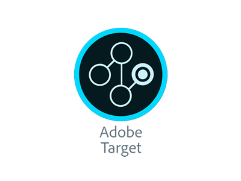

import { Appear, Head } from 'mdx-deck'
import { FullScreenCode, Invert, Split } from 'mdx-deck/layouts'

export { default as theme } from './theme'

<Head>
  <title>Adobe Test & Target Presentation</title>
  <meta itemprop="name" content="Presentation Title" />
  <meta itemprop="description" content="My demo for a great company" />
</Head>

<center></center>

```notes
- 

```
---


<ol style={{ margin: '5px 0', color:'#007CC2', fontSize:'8vw', fontWeight: 'bold' }}>Welcome!</ol>
<ol style={{ margin: '25px 0', color:'#007CC2', fontSize:'4vw' }}>Michael Benefiel</ol>
<ol style={{ margin: '25px 0', color:'#007CC2', fontSize:'2vw' }}>December 5, 2019</ol>


---
<ol style={{ margin: '5px 0', color:'#007CC2', fontSize:'8vw', fontWeight: 'bold' }}>Table of Contents</ol>

<ul>
  <Appear>
    <ol style={{ margin: '25px 0', color:'#959BA1', fontSize:'3vw' }}>Tealium iQ Questions</ol>
    <ol style={{ margin: '25px 0', color:'#959BA1', fontSize:'3vw' }}>AudienceStream Exercises</ol>
    <ol style={{ margin: '25px 0', color:'#959BA1', fontSize:'3vw' }}>Extra Innings</ol>
    <ol style={{ margin: '25px 0', color:'#959BA1', fontSize:'3vw' }}>Questions</ol>
    <ol style={{ margin: '25px 0', color:'#959BA1', fontSize:'3vw' }}>Thank You</ol>
  </Appear>
</ul>

---
<ol style={{ margin: '5px 0', color:'#007CC2', fontSize:'8vw', fontWeight: 'bold' }}>Tealium iQ</ol>
<ol style={{ margin: '5px 0', color:'#007CC2', fontSize:'4vw' }}>Question #1</ol>

<ul>
  <Appear>
    <ol style={{ margin: '25px 0', color:'#959BA1', fontSize:'3vw' }}>How do we set up the Google Analytics tag? </ol>
    <ol style={{ margin: '25px 0', color:'#959BA1', fontSize:'3vw' }}> How can I set up a Google event based on a click? </ol>
    
  </Appear>
</ul>


```notes
- Create speaker notes in fenced code blocks
```

---

<ol style={{ margin: '5px 0', color:'#007CC2', fontSize:'8vw', fontWeight: 'bold' }}>Directions</ol>
<ul>
  <Appear>
    <ol style={{ margin: '25px 0', color:'#959BA1', fontSize:'3vw' }}>Set up a localhost server with an alias </ol>
    <ol style={{ margin: '25px 0', color:'#959BA1', fontSize:'3vw' }}>Log into TiQ and set up a Google Analytics tag (analytics.js)</ol>
    <ol style={{ margin: '25px 0', color:'#959BA1', fontSize:'3vw' }}>On your localhost webpage, use Google Analytics to trigger a click event on a link </ol>
  </Appear>
</ul>


---

<ol style={{ margin: '5px 0', color:'#00A8B6', fontSize:'6vw', fontWeight: 'bold' }}>Project | Localhost Alias</ol>

---
<ol style={{ margin: '5px 0px', color:'#007CC2', fontSize:'8vw', fontWeight: 'bold' }}>Project</ol>

<ul>
  <Appear>
    <ol style={{ margin: '25px 0', color:'#959BA1', fontSize:'3vw' }}>Node environment</ol>
    <ol style={{ margin: '25px 0', color:'#959BA1', fontSize:'3vw' }}>Spun up Express server </ol>
    <ol style={{ margin: '25px 0', color:'#959BA1', fontSize:'3vw' }}>Simple routing for demo</ol>
    <ol style={{ margin: '25px 0', color:'#959BA1', fontSize:'3vw' }}>Alias: www.tealiumdemo.com</ol>
  </Appear>
</ul>

---

---

<ol style={{ margin: '5px 0', color:'#00A8B6', fontSize:'6vw', fontWeight: 'bold' }}>Setting up GA Tag in TiQ</ol>


---
<ol style={{ margin: '5px 0px', color:'#007CC2', fontSize:'6vw', fontWeight: 'bold' }}>Quick Aside</ol>
<ol style={{ margin: '5px 0px', color:'#007CC2', fontSize:'4vw',  }}>Logging into TiQ</ol>

<ul>
  <Appear>
    <ol style={{ margin: '25px 0', color:'#959BA1', fontSize:'3vw' }}>Initial Tag and UDO Installation</ol>
    <ol style={{ margin: '25px 0', color:'#959BA1', fontSize:'3vw' }}>Code Center</ol>
    <ol style={{ margin: '25px 0', color:'#959BA1', fontSize:'3vw' }}>Insert into all pages you want connected</ol>
  </Appear>
</ul>

---

<ol style={{ margin: '5px 0px', color:'#007CC2', fontSize:'6vw', fontWeight: 'bold' }}>Setting up GA Tag</ol>

<ul>
  <Appear>
    <ol style={{ margin: '25px 0', color:'#959BA1', fontSize:'3vw' }}>Add GA Tag</ol>
    <ol style={{ margin: '25px 0', color:'#959BA1', fontSize:'3vw' }}>GA Tracking ID and domain name</ol>
    <ol style={{ margin: '25px 0', color:'#959BA1', fontSize:'3vw' }}>Data Layer: data mapping</ol>
    <ol style={{ margin: '25px 0', color:'#959BA1', fontSize:'3vw' }}>Load Rules: all pages</ol>
  </Appear>
</ul>

---


<ol style={{ margin: '5px 0px', color:'#007CC2', fontSize:'6vw', fontWeight: 'bold' }}>GA Event Tracking</ol>

<ul>
  <Appear>
    <ol style={{ margin: '25px 0', color:'#959BA1', fontSize:'3vw' }}>Used Extensions: GA_Click (JS Code) and jQuery onHandler</ol>
    <ol style={{ margin: '25px 0', color:'#959BA1', fontSize:'3vw' }}>Scoped to fire when button/link is clicked</ol>
  </Appear>
</ul>

---
export default FullScreenCode

```jsx
 $("#demo-link").on("click", function() {
        console.log("Handler for .click() called.");
        ga(
          "send",
          "event",
          "details_share",
          "details_share",
          "details_share_click"
        );
      });
```
---
<ol style={{ margin: '5px 0', color:'#00A8B6', fontSize:'6vw', fontWeight: 'bold' }}>Debugging | Verification</ol>

---

<ol style={{ margin: '5px 0px', color:'#007CC2', fontSize:'6vw', fontWeight: 'bold' }}>Chrome DevTools</ol>

<ul>
  <Appear>
    <ol style={{ margin: '25px 0', color:'#959BA1', fontSize:'3vw' }}>The console is your best friend</ol>
    <ol style={{ margin: '25px 0', color:'#959BA1', fontSize:'3vw' }}>utag.js debug mode: document.cookie="utagdb=true"</ol>
    <ol style={{ margin: '25px 0', color:'#959BA1', fontSize:'3vw' }}>Verify events are firing properly</ol>
    <ol style={{ margin: '25px 0', color:'#959BA1', fontSize:'3vw' }}>Verify via Network tab: network log</ol>
    <ol style={{ margin: '25px 0', color:'#959BA1', fontSize:'3vw' }}>Fallback: Check realtime statistics on Analytics account</ol>
  </Appear>
</ul>

---


```notes
- 
```

---

<ol style={{ margin: '5px 0', color:'#007CC2', fontSize:'8vw', fontWeight: 'bold' }}>AudienceStream</ol>
<ol style={{ margin: '5px 0', color:'#007CC2', fontSize:'4vw' }}>Exercise #1</ol>
<ul>
  <Appear>
    <ol style={{ margin: '25px 0', color:'#959BA1', fontSize:'3vw' }}>Utilizing https://www.americangirl.com, create a category browser attribute when a visitor has visited a category page five or more times in their lifetime.</ol>
        
  </Appear>
</ul>

---
<ol style={{ margin: '5px 0px', color:'#007CC2', fontSize:'6vw', fontWeight: 'bold' }}>Implementation</ol>

<ul>
  <Appear>
    <ol style={{ margin: '25px 0', color:'#959BA1', fontSize:'3vw' }}>The console is your best friend: verify page_type (UDO)</ol>
    <ol style={{ margin: '25px 0', color:'#959BA1', fontSize:'3vw' }}>Once in AudienceStream, click "Attributes": add attribute - visitor scope</ol>
    <ol style={{ margin: '25px 0', color:'#959BA1', fontSize:'3vw' }}>Create page_type: category "number" attribute: increment category page visits by one</ol>
    <ol style={{ margin: '25px 0', color:'#959BA1', fontSize:'3vw' }}>Create "Category Browser" Badge attribute to be assigned after threshold is met</ol>
  </Appear>
</ul>

---


```notes
- 
```
---

<ol style={{ margin: '5px 0', color:'#007CC2', fontSize:'8vw', fontWeight: 'bold' }}>AudienceStream</ol>
<ol style={{ margin: '5px 0', color:'#007CC2', fontSize:'4vw' }}>Exercise #2</ol>
<ul>
  <Appear>
    <ol style={{ margin: '25px 0', color:'#959BA1', fontSize:'3vw' }}>Create a favorite product attribute when a visitor has viewed a product five or more times.</ol>
        
  </Appear>
</ul>
---
<ol style={{ margin: '5px 0px', color:'#007CC2', fontSize:'6vw', fontWeight: 'bold' }}>Implementation</ol>

<ul>
  <Appear>
    <ol style={{ margin: '25px 0', color:'#959BA1', fontSize:'3vw' }}>Create Product SKU "set of strings" attribute</ol>
    <ol style={{ margin: '25px 0', color:'#959BA1', fontSize:'3vw' }}>Create page_type: product "number" attribute to increment page visits by one</ol>
    <ol style={{ margin: '25px 0', color:'#959BA1', fontSize:'3vw' }}>Create "Favorite Product" Badge attribute to be assigned if someone views product five or more times</ol>
    
  </Appear>
</ul>
---


```notes
- 
```
---
<ol style={{ margin: '5px 0', color:'#007CC2', fontSize:'8vw', fontWeight: 'bold' }}>Extra Innings</ol>

<ul>
  <Appear>
    <ol style={{ margin: '25px 0', color:'#959BA1', fontSize:'3vw' }}>Can you walk us through how to trigger a basic modal on your webpage?</ol>
    <ol style={{ margin: '25px 0', color:'#959BA1', fontSize:'3vw' }}>We have a DoubleClick Floodlight tag that we only want to fire once per session. Is there a way to do this in Tealium?</ol>
    <ol style={{ margin: '25px 0', color:'#959BA1', fontSize:'3vw' }}>Create an audience based off of information available to the site and explain what you would use this audience for.</ol>
  
  </Appear>
</ul>
---
<ol style={{ margin: '5px 0', color:'#00A8B6', fontSize:'6vw', fontWeight: 'bold' }}>Triggering a basic modal</ol>
---
<ol style={{ margin: '5px 0px', color:'#007CC2', fontSize:'6vw', fontWeight: 'bold' }}>Walk Through</ol>

<ul>
  <Appear>
    <ol style={{ margin: '25px 0', color:'#959BA1', fontSize:'3vw' }}>Once in TiQ, add Modal Offer Extension</ol>
    <ol style={{ margin: '25px 0', color:'#959BA1', fontSize:'3vw' }}>Block modal from firing on DOM Ready</ol>
    <ol style={{ margin: '25px 0', color:'#959BA1', fontSize:'3vw' }}>Add JavaScript Code Extension</ol>
    <ol style={{ margin: '25px 0', color:'#959BA1', fontSize:'3vw' }}>Add your custom action to website and extension</ol>
  </Appear>
</ul>

---
<ol style={{ margin: '25px 0px', color:'#007CC2', fontSize:'6vw', fontWeight: 'bold' }}>Delayed Modal Trigger</ol>


```notes
- 
```
---
<ol style={{ margin: '5px 0', color:'#00A8B6', fontSize:'6vw', fontWeight: 'bold' }}>DoubleClick Floodlight Tag</ol>
---
<ol style={{ margin: '5px 0', color:'#007CC2', fontSize:'6vw', fontWeight: 'bold' }}>Fire once per session?</ol>
<ul>
  <Appear>
    <ol style={{ margin: '25px 0', color:'#959BA1', fontSize:'3vw' }}>Tealium now sets a "Session Start" cookie called "utag_main__ss." This is set to "1" on the first page of the visit and "0" on subsequent pages</ol>
    <ol style={{ margin: '25px 0', color:'#959BA1', fontSize:'3vw' }}>Add a Data Source called "utag_main__ss" and set the Type to "First Party Cookie"</ol>
    <ol style={{ margin: '25px 0', color:'#959BA1', fontSize:'3vw' }}>Use this in the Load Rule to check if the cookie equals "1"</ol>
    <ol style={{ margin: '25px 0', color:'#959BA1', fontSize:'3vw' }}>This requires version 4.26 or later of the utag.js file</ol>
  </Appear>
</ul>
---
<ol style={{ margin: '5px 0', color:'#00A8B6', fontSize:'6vw', fontWeight: 'bold' }}>Creating an Audience</ol>
---
<ol style={{ margin: '5px 0', color:'#007CC2', fontSize:'6vw', fontWeight: 'bold' }}>Implementation</ol>
<ul>
  <Appear>
    <ol style={{ margin: '25px 0', color:'#959BA1', fontSize:'3vw' }}>Add audience</ol>
    <ol style={{ margin: '25px 0', color:'#959BA1', fontSize:'3vw' }}>Keep parameters simple</ol>
    <ol style={{ margin: '25px 0', color:'#959BA1', fontSize:'3vw' }}>Add connector</ol>
    
  </Appear>
</ul>
---
<ol style={{ margin: '5px 0', color:'#007CC2', fontSize:'6vw', fontWeight: 'bold' }}>My example</ol>
<ul>
  <Appear>
    <ol style={{ margin: '25px 0', color:'#959BA1', fontSize:'3vw' }}>I created a "Category Browsers" audience for individuals who have viewed a category page five or more times. I'd set up a connector with Facebook Ads and target Category Browsers with advertisements tailored with the products of the category they viewed five or more times (ie, books, dolls, clothing, etc.)</ol>
  </Appear>
</ul>
---


```notes
- 
---
<ol style={{ margin: '5px 0', color:'#00A8B6', fontSize:'6vw', fontWeight: 'bold' }}>Questions?</ol>
---
<ol style={{ margin: '5px 0', color:'#007CC2', fontSize:'6vw', fontWeight: 'bold' }}>Thank you for this opportunity</ol>
<ul>
  <Appear>
    <ol style={{ margin: '25px 0', color:'#959BA1', fontSize:'3vw' }}>Slideshow: https://mjb-presentation.netlify.com</ol>
    <ol style={{ margin: '25px 0', color:'#959BA1', fontSize:'3vw' }}>Portfolio: https://mjbenefiel.github.io</ol>
    <ol style={{ margin: '25px 0', color:'#959BA1', fontSize:'3vw' }}>GitHub: https://github.com/mjbenefiel</ol>
    <ol style={{ margin: '25px 0', color:'#959BA1', fontSize:'3vw' }}>LinkedIn: https://www.linkedin.com/in/michaeljbenefiel</ol>
  </Appear>
</ul>